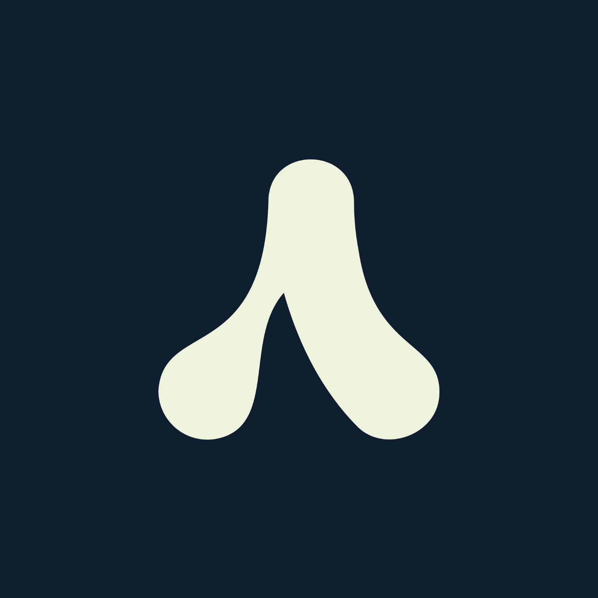

<!-- Set 'back to top' link -->
<a name="readme-top">

<!-- Project Header -->
<div align="center">
  <a ref="https://github.com/ClubAlgoritmiaGDA/website">
    
  </a>
<h2 align="center">Club Algorítmia GDA</h2>

  <p align="center">
  Club Website
  </p>
</div>

<!-- Table of contents #TODO -->

<!-- About the project -->
## About The Project

A simple, easy to use website containing 4 main sections, a landing page, a resources page, an events calendar,
and information about the club. The main purpose of the site is to host all the places people can go to learn more,
so the resources page should have highest priority. There should also be a link to the main group chat.

<p align="right">(<a href="#readme-top">back to top</a>)</p>

### Built With:
* [![Next][Next.js]][Next-url]
* [![Tailwind][TailwindCSS]][TailwindCSS-url]
* [![Shadcn/ui][Shadcn.ui]][Shadcn.ui-url]

<p align="right">(<a href="#readme-top">back to top</a>)</p>


<!-- Getting Started -->
## Getting Started
**TODO: Show sections for local testing**
### Prerequisites
```sh
pass
```
### Installation
```sh
yarn
yarn run dev
```
<p align="right">(<a href="#readme-top">back to top</a>)</p>


<!-- Contributions -->
## Contributing
**TODO: Properly define steps to contribute to project**
1. Fork project
2. Create feature branch
3. Commit your changes
4. Push to local branch
5. Open a pull request

<p align="right">(<a href="#readme-top">back to top</a>)</p>


<!-- License -->
## License
Distributed under the GNU General Public License. See `LICENSE` for more information.

<p align="right">(<a href="#readme-top">back to top</a>)</p>


<!-- Contact -->
## Contact
If you need to contact any staff, here's our info:
- Miguel Nguyen: [msninmx@gmail.com](msninmx@gmail.com)

<!-- Links and Images -->
[Next.js]: https://img.shields.io/badge/next.js-000000?style=for-the-badge&logo=nextdotjs&logoColor=white
[Next-url]: https://nextjs.org/
[TailwindCSS]: https://img.shields.io/badge/Tailwind_CSS-38B2AC?style=for-the-badge&logo=tailwind-css&logoColor=white
[TailwindCSS-url]: https://tailwindcss.com/
[Shadcn.ui]: https://img.shields.io/badge/shadcn/ui-000000?style=for-the-badge&logo=slashdot&logoColor=white
[Shadcn.ui-url]: https://ui.shadcn.com/
